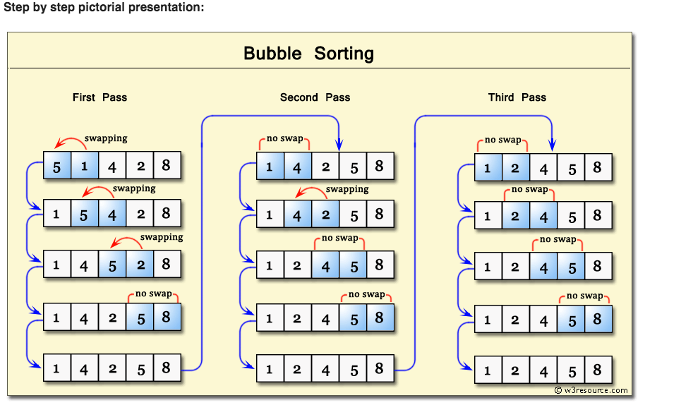

# Sorting

Sorting is considered to be an important concept in many programming languages as it helps us locate elements in a faster and easier manner.
In this repo, I will use sorting algorithms to sort an array. There are at least 8 different sorting algorithms in JavaScript. In order to keep this post short but still full of helpful knowledge, I will be focusing on the following four algorithms:
- `Bubble Sort`
- `Insertion Sort`
- `Merge Sort`
- `Quick Sort`

### Bubble sort
- Bubble sort, sometimes referred to as `sinking sort`, is a simple sorting algorithm that works by repeatedly stepping through the list to be sorted, comparing each pair of adjacent items and swapping them if they are in the wrong order".

- `Demo`
   

### Insertion sort
- Insertion sort is a method of sorting an array by dividing the array into a 'sorted' portion and 'unsorted' portion. Then we compare the unsorted item to see if it is larger than the previous element, if not we insert the new item. Basically we are looking from left to right and sorting as we go.

- `Demo`
 - Iteration 0 (unsorted array): [5,3,1,4,6]
 - Iteration 1, key is 3 (was at index 1): [5,3,1,4,6] →[3,5,1,4,6]
 - Iteration 2, key is 1 (was at index 2): [3,5,1,4,6] →[1,3,5,4,6]
 - Iteration 3, key is 4 (was at index 3, ): [1,3,5,4,6] → [1,3,4,5,6]
 - Iteration 4, key is 6 (was at index 4): [1,3,4,5,6] → [1,3,4,5,6] — because 6 was already in the right place, no changes are made and insertion sort returns the sorted array. Notice how after each step, all the items to the left of the key are already sorted.

 ### Merge Sort
 - Merge sort is an example of a divide-and-conquer type sorting-algorithm. The input for merge sort is an array of integers of length n, which needs to be sorted, typically from least to greatest. What merge sort does is it splits the unsorted array into two parts and then you recursively apply merge sort to these sub-arrays to further split the arrays until you are left with a bunch of single-element arrays. Then, you compare single-element arrays to one another before recombining them into a two-element, sorted array (and so on). If you do this repeatedly, eventually you end up with a single, sorted array of length n.

 - `Complexity`
 - The time complexity of this algorithm, at worst case, is linearithmic — O(log n!). This is one of the more efficient sorting algorithms, which is why most browsers use merge sort as the built in Array.sort method.

 - `Demo`
    

### Quick Sort
- Quicksort is a divide and conquer algorithm in the style of merge sort. The basic idea is to find a “pivot” item in the array to compare all other items against, then shift items such that all of the items before the pivot are less than the pivot value and all the items after the pivot are greater than the pivot value.
